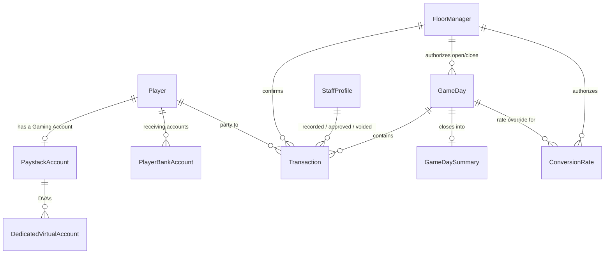

# Data Model / Schema Plan

Target: Django + PostgreSQL. This is a plan to review, not code — field names/types are Django-flavored so it translates directly into `models.py` once approved.

## Design principles

1. **One master ledger, four views.** All of Game-day ledger, Player game-day ledger, Outstanding ledger, and Main account ledger are read-only *filtered views* over a single `Transaction` table — never separately maintained tables. This is what makes the four ledgers structurally unable to disagree with each other (the mechanism behind "no reconciliation tool needed," discussed earlier).
2. **Balances are computed, not stored.** A player's balance, the game-day's running balance, and the Main account balance are all `SUM()` queries over `Transaction` rows up to a point in time — never a mutable running-total column. This avoids the classic stale-balance bug where a stored total drifts from its source rows.
3. **Corrections are soft.** Rows are voided (with an audit trail: who, when, why), never hard-deleted — matches the Cashier-same-day / Owner-post-close correction rules already decided.
4. **Money**: `DecimalField` in Naira-equivalent value. Chips are 1:1 with Naira value per the brief's own examples (500,000 chips ~ ₦500,000), so no separate "chip" unit exists in the schema.

## Entities

#### `Player`
- `account_code` — club-assigned short code (e.g. "WWI 7"), unique
- `display_name`
- `is_active`, `created_at`

#### `PaystackAccount`
Represents either the singleton **Main account** or a player's **Gaming Account** — merged into one table since the brief gives them identical shape (DVAs, keys, webhook, transfer endpoints).
- `account_type` — `MAIN` | `GAMING`
- `player` — FK → Player, null for `MAIN`, required+unique for `GAMING`
- `paystack_integration_id`, `integration_name`
- `public_key`, `secret_key` (encrypted at rest), `webhook_secret`
- `created_at`
- App-level constraint: exactly one `MAIN` row must exist

#### `DedicatedVirtualAccount`
- `paystack_account` — FK → PaystackAccount
- `bank_name`, `bank_code`, `account_number`, `account_name`
- `is_active`, `created_at`

#### `PlayerBankAccount` (receiving account for cash-outs; Cashier-managed)
- `player` — FK → Player
- `bank_name`, `bank_code`, `account_number`, `account_name`
- `is_default`, `created_at`

#### `StaffProfile` (Cashier / Accountant / Owner — real logins)
- `user` — OneToOne → Django `User`
- `role` — `CASHIER` | `ACCOUNTANT` | `OWNER`
- `is_active`, `created_at`

#### `FloorManager` (not a login — a named confirmation credential)
- `name`
- `pin_hash` — hashed, never stored plaintext
- `is_active`
- `created_by` — FK → StaffProfile (an Owner)
- `created_at`

#### `GameDay`
- `number` — sequential display number, unique
- `started_at`, `ended_at` (null while open)
- `status` — `OPEN` | `CLOSED`
- `opened_by` — FK → StaffProfile (the operator whose session performed the action, typically Cashier)
- `opened_by_floor_manager` — FK → FloorManager, null; **required unless `opened_by.role == OWNER`** — Cashier can't open a game-day solo
- `closed_by` — FK → StaffProfile
- `closed_by_floor_manager` — FK → FloorManager, null; optional — Cashier or Owner can close solo, or a Floor Manager PIN can authorize it instead

#### `ConversionRate`
- `currency` — `USD` | `GBP` | `EUR` | `OTHER` (NGN implicit = 1)
- `rate_to_naira`
- `game_day` — FK → GameDay, null = standing/default rate; set = override for that specific game-day
- `set_by` — FK → StaffProfile (the operator)
- `set_by_floor_manager` — FK → FloorManager, null; **required unless `set_by.role == OWNER`**
- `created_at` — immutable; a rate change is a new row, never an edit, per the brief's "past rates can't be changed"

#### `Transaction` — the master ledger
- `game_day` — FK → GameDay, **null** for between-game-day entries (these feed the Outstanding ledger only)
- `player` — FK → Player, null only for `RAKE`/`TIP`
- `type` — one of:
  `CHIPS_OUT`, `CHIPS_IN`, `CHIPS_OFFSITE_OUT`, `CHIPS_OFFSITE_RETURN`,
  `PAYMENT_CASH`, `PAYMENT_TRANSFER`, `PAYMENT_POS`, `PAYMENT_DEAL`,
  `PAYOUT`, `WRITE_OFF`, `RAKE`, `TIP`
- `amount` — always positive
- `currency`, `conversion_rate` — relevant to `PAYMENT_CASH` only; `conversion_rate` is a snapshot value, not a live FK, so history never shifts
- `channel` — `CASHIER` | `TRANSFER_DVA` | `CASH` | `POS` | `CHIPS` | `DEAL` | `WRITE_OFF` (drives the ledger's "icon" column)
- `notes`
- `recorded_by` — FK → StaffProfile, null for webhook-auto-captured rows
- `floor_manager` — FK → FloorManager, set only for physical-count types (`CHIPS_*`, `PAYMENT_CASH`, `RAKE`, `TIP`)
- `confirmed_at` — when the FM PIN was validated
- `status` — `POSTED` | `PENDING_APPROVAL` | `APPROVED` | `REJECTED` (only `PAYOUT` uses the non-`POSTED` states, per "every payout needs Owner approval")
- `approved_by`, `approved_at` — FK → StaffProfile (Owner)
- `is_voided`, `voided_by`, `voided_at`, `void_reason` — soft-correction trail
- `external_reference` — Paystack transaction ID; unique when set, used for webhook idempotency (prevents double-processing a retried webhook)
- `created_at`

Note: `Deal` and write-off/credit are **not** separate tables — they're `Transaction` rows (`PAYMENT_DEAL`, `WRITE_OFF`) authored by an Owner. Their own approval is implicit: only an Owner can create them, so there's no separate approval workflow to model.

#### `GameDaySummary` (snapshot, written once at close — not computed live)
Captures "final position" fields the brief says only exist after a game-day closes: `num_players`, `chips_out_total`, `chips_in_total`, `rake_total`, `tips_total`, `chips_outstanding`, `total_payments`, `game_balance`. One row per `GameDay`, written at close time so historical game-days don't need recomputation.

## The four ledgers, as queries over `Transaction`

| Ledger | Filter |
|---|---|
| Game-day ledger | `game_day = X`, excluding `RAKE`/`TIP` |
| Player game-day ledger | above + `player = Y` |
| Outstanding ledger | `game_day IS NULL` (between-game-day payments/deals), per player |
| Main account ledger | `channel = TRANSFER_DVA` (sweep-ins) OR `type = PAYOUT` (transfers out) — the only rows that actually touch the bank |

## ERD

## Modeling calls made — flag if any should change

- Main account and Gaming Accounts merged into one `PaystackAccount` table (type-flagged) rather than two tables — they're structurally identical in the brief.
- `Deal` and write-off/credit given no dedicated table — modeled as `Transaction` subtypes, since only the Owner can author either and both just move an amount against a player.
- Balances (player, game-day, Main account) are always computed at query time — nothing is cached except the `GameDaySummary` snapshot taken at close.
- `CreditRequest` (Owner "approve credit request") isn't modeled yet — it depends on the deferred Player app (phase 2), since there's no v1 path for a player to originate a request without a login.
- Notification and general activity-log tables aren't modeled yet — pending the still-open notification matrix; most financial activity is already attributable via `recorded_by`/`approved_by`/`voided_by`/`floor_manager` on `Transaction`.
