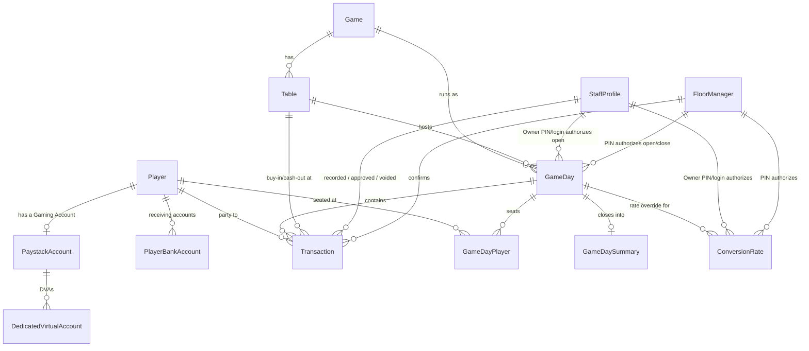

# Data Model / Schema Plan

Target: Django + PostgreSQL. This is a plan to review, not code — field names/types are Django-flavored so it translates directly into `models.py` once approved.

## Design principles

1. **One master ledger, four views.** Game-day ledger, Player game-day ledger, Outstanding ledger, and Main account ledger are read-only *filtered views* over a single `Transaction` table — never separately maintained tables. This is what makes the four ledgers structurally unable to disagree with each other (the mechanism behind "no reconciliation tool needed," discussed earlier). (A fifth, Table ledger, briefly existed 2026-09-21 alongside a two-step chip-custody model — both reverted the same day; see the dated note under "Modeling calls made.")
2. **Balances are computed, not stored.** A player's balance, the game-day's running balance, and the Main account balance are all `SUM()` queries over `Transaction` rows up to a point in time — never a mutable running-total column. This avoids the classic stale-balance bug where a stored total drifts from its source rows.
3. **Corrections are soft.** Rows are voided (with an audit trail: who, when, why), never hard-deleted — matches the Cashier-same-day / Owner-post-close correction rules already decided.
4. **Money**: `DecimalField` in Naira-equivalent value. Chips are 1:1 with Naira value per the brief's own examples (500,000 chips ~ ₦500,000), so no separate "chip" unit exists in the schema.

## Entities

#### `Player`
- `account_code` — club-assigned short code (e.g. "WWI 7"), unique
- `display_name`
- `chips_limit` — `DecimalField`, nullable (null = no cap), Owner-set-and-edited only. Per-game-day credit ceiling: checked against the player's *current game-day debt* (chips issued minus paid/returned so far that game-day), not a lifetime or per-transaction cap. Added 2026-09-13 — see `CONCEPT.md`'s "Chips limit."
- `is_active`, `created_at`

#### `PaystackAccount`
Represents either the singleton **Main account** or a player's **Gaming Account** — merged into one table since both have identical shape. Revised 2026-09-13: there is only ONE Paystack integration for the whole club (one key pair, in Django settings — see `paystack_client.py`), not a separate integration per player as originally drafted — see `CONCEPT.md`'s "Built — real Paystack integration." A Gaming Account is a Paystack **Customer** + a **Dedicated Virtual Account** under that one integration.
- `account_type` — `MAIN` | `GAMING`
- `player` — FK → Player, null for `MAIN`, required+unique for `GAMING`
- `paystack_customer_code` — blank for `MAIN` (renamed from `paystack_integration_id` 2026-09-13)
- `label` — display name (renamed from `integration_name` 2026-09-13); e.g. "LPC Main Account", or the player's name for a `GAMING` row
- ~~`public_key`, `secret_key`, `webhook_secret`~~ — removed 2026-09-13: there's only ever one of each, already in settings (`PAYSTACK_SECRET_KEY`/`PAYSTACK_PUBLIC_KEY`); nothing per-row to store
- `created_at`
- App-level constraint: exactly one `MAIN` row must exist

#### `DedicatedVirtualAccount`
- `paystack_account` — FK → PaystackAccount
- `paystack_dva_id` — Paystack's own id for this DVA, for future deactivation calls. Added 2026-09-13.
- `bank_name`, `bank_code`, `account_number`, `account_name`
- `is_active`, `created_at`

#### `PlayerBankAccount` (receiving account for cash-outs; Cashier-managed)
- `player` — FK → Player
- `bank_name`, `bank_code`, `account_number`, `account_name`
- `is_default`, `created_at`
- `paystack_recipient_code` — cached Paystack transfer recipient, created once on first payout attempt and reused after. Added 2026-09-13.

#### `StaffProfile` (Cashier / Accountant / Owner — real logins)
- `user` — OneToOne → Django `User`
- `role` — `CASHIER` | `ACCOUNTANT` | `OWNER`
- `pin_hash` — hashed, nullable; mirrors `FloorManager.pin_hash`. In v1 only Owner-role rows have one set — it's how the Owner authenticates in-person for Open Game-Day / Set Conversion Rate without a full login-switch on the Cashier's device. Added 2026-09-13.
- `is_active`, `created_at`

#### `FloorManager` (not a login — a named confirmation credential)
- `name`
- `pin_hash` — hashed, never stored plaintext
- `is_active`
- `created_by` — FK → StaffProfile (an Owner)
- `created_at`

#### `Game` (added 2026-09-21)
- `name` — e.g. "Texas Hold'em", "Omaha"; unique
- `is_active`
- Owner-managed CRUD is explicitly parked; the initial rows are seeded via a data migration.

#### `Table` (added 2026-09-21)
- `game` — FK → Game
- `name`
- `default_buy_in` — pre-fills the "Start game-day" flow's Buy-in step; not a hard rule — see `GameDay.buy_in_amount` below.
- `is_active`
- "One table per game, for now" is a UI/data convention (via the seed migration), not a DB constraint — a second `Table` row for the same `Game` is valid and needs no schema change.

#### `GameDay`
- `number` — sequential display number, unique
- `started_at`, `ended_at` (null while open)
- `status` — `OPEN` | `CLOSED`
- `opened_by` — FK → StaffProfile, **nullable** (revised 2026-09-13). Set to the resolved **Owner** when an Owner's PIN or login authorized the open; **null** when a Floor Manager's PIN authorized it instead (a Floor Manager has no `StaffProfile` row to point to). Never set to a Cashier, regardless of which staff device/session the request came through — a Cashier is never the authorizer, only (at most) the one physically tapping the screen.
- `opened_by_floor_manager` — FK → FloorManager, null; set when a Floor Manager's PIN was the authorizer (mutually exclusive with `opened_by` being set to an Owner)
- `closed_by` — FK → StaffProfile
- `closed_by_floor_manager` — FK → FloorManager, null; optional — Cashier or Owner can close solo, or a Floor Manager PIN can authorize it instead
- `game`, `table` — FK → Game/Table, both nullable (added 2026-09-21; null only for game-days from before this change) — which game/table this game-day is running, chosen in the "Start game-day" flow
- `buy_in_amount` — nullable, **snapshotted** from `table.default_buy_in` at open time (same "copy now, don't re-derive" precedent as `Transaction.conversion_rate`) — an independent choice each night, with a pre-filled default, never re-derived from a later edit to the table

#### `GameDayPlayer` — "seated at tonight's table" (added 2026-09-14)
Not one of the four computed ledgers — a genuine new stored fact, because a player's presence in a game-day can't always be derived from `Transaction` rows alone (the Buy-in flow has a real gap: added → given DVA details → *then* issued chips; during that gap there's no transaction yet to derive presence from).
- `game_day` — FK → GameDay
- `player` — FK → Player
- `added_by` — FK → StaffProfile, nullable (a Cashier or Owner explicitly seated them, or it was inferred — see below)
- `added_at`
- Unique on (`game_day`, `player`). Rows are never deleted — historical record of who was part of a given game-day, same principle as everything else here.
- Created two ways: explicitly (the "add a player for tonight" action) or implicitly, as a side effect of recording any transaction/payout for that player+game_day pair that hasn't been seated yet (`get_or_create` — a player can't have real activity tonight without also appearing seated).
- Backs the Cashier-facing Players screen, which is scoped to the current game-day only — **not** a query over `Player` directly.

#### `ConversionRate`
- `currency` — `USD` | `GBP` | `EUR` | `OTHER` (NGN implicit = 1)
- `rate_to_naira`
- `game_day` — FK → GameDay, null = standing/default rate; set = override for that specific game-day
- `set_by` — FK → StaffProfile, **nullable** (revised 2026-09-13, same reasoning as `GameDay.opened_by`) — the resolved Owner, or null if a Floor Manager's PIN authorized it
- `set_by_floor_manager` — FK → FloorManager, null; set when a Floor Manager's PIN was the authorizer
- `created_at` — immutable; a rate change is a new row, never an edit, per the brief's "past rates can't be changed"

#### `Transaction` — the master ledger
- `game_day` — FK → GameDay, **null** for between-game-day entries (these feed the Outstanding ledger only)
- `player` — FK → Player, null only for `RAKE`/`TIP`
- `type` — one of:
  `CHIPS_OUT`, `CHIPS_IN`,
  `PAYMENT_CASH`, `PAYMENT_TRANSFER`, `PAYMENT_POS`, `PAYMENT_DEAL`,
  `PAYOUT`, `WRITE_OFF`, `RAKE`, `TIP`,
  `DEAL_TRANSFER_OUT`/`DEAL_TRANSFER_IN`, `PROFIT_SPLIT_STAKE` (added 2026-09-20 — "Deals"),
  `TABLE_BUY_IN`/`TABLE_CASH_OUT` (added 2026-09-21 — see below)
  (`CHIPS_OFFSITE_OUT`/`CHIPS_OFFSITE_RETURN` **removed 2026-09-13** — off-site/excess chips are no longer a `Transaction` at all; see `GameDaySummary.chips_variance` below)
- `amount` — always positive
- `currency`, `conversion_rate` — relevant to `PAYMENT_CASH` only; `conversion_rate` is a snapshot value, not a live FK, so history never shifts
- `channel` — `CASHIER` | `TRANSFER_DVA` | `CASH` | `POS` | `CHIPS` | `DEAL` | `WRITE_OFF` (drives the ledger's "icon" column)
- `notes`
- `recorded_by` — FK → StaffProfile, null for webhook-auto-captured rows
- `floor_manager` — FK → FloorManager, set only for physical-count types (`CHIPS_OUT`, `CHIPS_IN`, `PAYMENT_CASH`, `RAKE`, `TIP`, and — added 2026-09-21 — `TABLE_BUY_IN`/`TABLE_CASH_OUT`) — never Owner-authorized, a dual-witness count is always a Floor Manager PIN specifically
- `table` — FK → Table, null; set only on `TABLE_BUY_IN`/`TABLE_CASH_OUT` (added 2026-09-21) — deliberately excluded from `DEBIT_TYPES`/`CREDIT_TYPES`, so these never touch `player_balance`/`player_game_day_balance`/`GameDaySummary`'s chips figures — see the "Game/Table selection + two-step chip custody" modeling-call entry below
- `confirmed_at` — when the FM PIN was validated
- `status` — `POSTED` | `PENDING_APPROVAL` | `APPROVED` | `REJECTED` | `TRANSFER_FAILED` (only `PAYOUT` uses the non-`POSTED` states, per "every payout needs Owner approval"). `TRANSFER_FAILED` added 2026-09-13: the Owner approved, but the real Paystack transfer didn't go through (no bank account on file, Paystack rejected it, ...) — distinct from `REJECTED` (an Owner's business decision); a `TRANSFER_FAILED` payout can be re-approved once the underlying issue is fixed.
- `approved_by`, `approved_at` — FK → StaffProfile (Owner)
- `is_voided`, `voided_by`, `voided_at`, `void_reason` — soft-correction trail
- `external_reference` — Paystack transaction ID; unique when set, used for webhook idempotency (prevents double-processing a retried webhook)
- `created_at`

Note: `Deal` and write-off/credit are **not** separate tables — they're `Transaction` rows (`PAYMENT_DEAL`, `WRITE_OFF`) authored by an Owner. Their own approval is implicit: only an Owner can create them, so there's no separate approval workflow to model.

#### `GameDaySummary` (snapshot, written once at close — not computed live)
Captures "final position" fields the brief says only exist after a game-day closes: `num_players`, `chips_out_total`, `chips_in_total`, `rake_total`, `tips_total`, `chips_variance`, `total_payments`, `game_balance`. One row per `GameDay`, written at close time so historical game-days don't need recomputation.
- `chips_variance` — `DecimalField`, signed (renamed from the original, never-implemented `chips_outstanding` placeholder — same slot, precise definition added 2026-09-13). Computed at close as `chips_out_total − chips_in_total − rake_total − tips_total`: **positive** = unreturned/off-site chips for this game-day; **negative** = excess chips returned this game-day (chips that went off-site on an earlier day coming back into play). The club-wide **Outstanding Chips** figure shown to Accountant/Owner is a live `SUM(chips_variance)` over every closed `GameDaySummary` row — not a stored running total, consistent with the "balances computed, not stored" principle above.

## The four ledgers, as queries over `Transaction`

| Ledger | Filter |
|---|---|
| Game-day ledger | `game_day = X`, excluding `RAKE`/`TIP` |
| Player game-day ledger | above + `player = Y` |
| Outstanding ledger | `game_day IS NULL` (between-game-day payments/deals), per player — **Owner/Accountant only** as of 2026-09-13 (`IsOwnerOrAccountant`, replacing the current `IsAuthenticated`); a Cashier never reaches this, consistent with no cross-game-day history being shown to that role |
| Main account ledger | `channel = TRANSFER_DVA` (sweep-ins) OR `type = PAYOUT` (transfers out) — the only rows that actually touch the bank |

A fifth, Table ledger (`game_day = X, table = T`, over `TABLE_BUY_IN`/
`TABLE_CASH_OUT`) existed briefly 2026-09-21 alongside a two-step
chip-custody model — both reverted the same day (see "Modeling calls made"
below); back to four.

## ERD

## Modeling calls made — flag if any should change

- Main account and Gaming Accounts merged into one `PaystackAccount` table (type-flagged) rather than two tables — they're structurally identical in the brief.
- `Deal` and write-off/credit given no dedicated table — modeled as `Transaction` subtypes, since only the Owner can author either and both just move an amount against a player.
- Balances (player, game-day, Main account) are always computed at query time — nothing is cached except the `GameDaySummary` snapshot taken at close.
- `CreditRequest` (Owner "approve credit request") isn't modeled yet — it depends on the deferred Player app (phase 2), since there's no v1 path for a player to originate a request without a login.
- Notification and general activity-log tables aren't modeled yet — pending the still-open notification matrix; most financial activity is already attributable via `recorded_by`/`approved_by`/`voided_by`/`floor_manager` on `Transaction`.
- **Chips-limit enforcement lives in `record_transaction`, not the serializer alone.** ✅ Built 2026-09-13: on a `CHIPS_OUT` attempt, computes the player's current game-day debt via `selectors.player_game_day_balance` + the new amount; raises `InvalidStateError` before the Floor Manager PIN step runs if `player.chips_limit` is set and would be exceeded.
- **Authorizer resolution generalizes from Floor-Manager-only to Floor-Manager-or-Owner.** ✅ Built 2026-09-13, shipped slightly differently than first sketched here: rather than renaming `_resolve_floor_manager(floor_manager_id, pin)` into one combined `_resolve_authorizer(authorizer_type, authorizer_id, pin)`, `_resolve_floor_manager` was kept as-is and a new `_resolve_owner_pin(owner_id, pin)` added alongside it, unified by a `_resolve_owner_or_floor_manager` wrapper — less churn on the existing FM-only call sites (physical-count confirmations), same effect. `GameDay.opened_by`/`ConversionRate.set_by` are now nullable (`limit_choices_to={'role': OWNER}`).
- **Cashier-facing "today's balance" is a new selector, not a new field.** ✅ Built 2026-09-13: `player_game_day_balance(player, game_day)` — a signed `SUM()` over `Transaction` rows scoped to one `game_day`, mirroring the existing lifetime `player_balance(player)` but bounded. `PlayerSerializer.get_balance` returns it instead of the lifetime `balance` for a Cashier caller when the lifetime figure is negative; positive values still return the lifetime figure regardless of caller role.
- **A "Gaming Account" is a Paystack Customer + Dedicated Virtual Account, not a separate Paystack integration.** ✅ Built 2026-09-13: the original brief modeled each GA with its own key pair and webhook (mirrored in `PaystackAccount`'s original `public_key`/`secret_key`/`webhook_secret` fields), which isn't a real Paystack primitive — there is one integration, one key pair, one webhook, club-wide. `payments/paystack_client.py` wraps the real endpoints (`/customer`, `/dedicated_account`, `/transferrecipient`, `/transfer`); `payments/services.provision_gaming_account(player)` creates a Customer+DVA on demand (no "next available GA" pool — see `CONCEPT.md`). One consequence: there's no real "sweep to Main account" money movement (only one Paystack balance exists), so `sweep_to_main_account` was retired; a payout's approval now calls the real Transfer API instead, landing in the new `TRANSFER_FAILED` status if it can't complete.
- **A player's presence in a game-day needed a real stored fact, not just a derived query.** ✅ Built 2026-09-14: `GameDayPlayer` (see above) — the four ledgers are all *views* over `Transaction`, but "who's seated tonight" can't be, because a player can be added before their first transaction exists. This is the one genuinely new stored concept added since the original design; everything else added this session (`chips_variance`, `pin_hash`, `chips_limit`, `TRANSFER_FAILED`, Paystack fields) was either a rename, a nullable relaxation, or an enum addition to an existing table.
- **Payout amount validated against game-day winnings, not left unbounded.** ✅ Built 2026-09-14: `gaming.services.initiate_payout` didn't validate the amount against anything before this — any figure was accepted and relied on Owner approval as the only check. It now hard-caps at the player's positive `player_game_day_balance` for the (now-defaulted-if-omitted) current game-day, the same enforcement posture as `chips_limit` on `CHIPS_OUT`. The Cashier-facing `balance` for this game-day's players list is this same figure, always — the earlier "positive lifetime, negative today-only" split (2026-09-13) is retired in favor of always-today's-figure (2026-09-14), since showing a lifetime positive number implied a payout up to that amount was possible when it no longer is.
- **Game/Table selection + two-step chip custody.** ✅ Built 2026-09-21. Two related additions:
  - New `Game`/`Table` entities back a real "Start game-day" flow (Game → Table → Buy-in). `GameDay` gains nullable `game`/`table`/`buy_in_amount` — `buy_in_amount` is *snapshotted* from `table.default_buy_in` at open time (same "copy now, don't re-derive" precedent as `Transaction.conversion_rate`), so it's an independent choice each night with a pre-filled default, never a hard rule baked into the table. Owner-managed CRUD for games/tables/buy-ins is explicitly parked; the two initial games/tables are seeded via a data migration.
  - The chip-custody model: two new balance-neutral `Transaction.Type`s, `TABLE_BUY_IN`/`TABLE_CASH_OUT` (a new `table` FK, set only on these), following the exact precedent `PROFIT_SPLIT_STAKE` already established — tracked, but deliberately outside `DEBIT_TYPES`/`CREDIT_TYPES`, so they never touch `player_balance`, `player_game_day_balance`, or `GameDaySummary`'s chips figures, which stay computed purely from `CHIPS_OUT`/`CHIPS_IN` exactly as before. Seating a player with a Table+Buy-in set auto-issued both `CHIPS_OUT` (house → player) and a linked `TABLE_BUY_IN` (into play at the table) with **no Floor Manager PIN**; leaving a table became a 3-way disposition (`gaming.services.LeaveDisposition`: `NO_RETURN`/`HOLD`/`CASH_OUT`). New selectors `player_chips_in_hand`/`table_chips_in_play` computed the custody/table-side figures live.
    **↩ Reverted 2026-09-21, same day.** In practice every normal buy-in fired the pair at once, so the Cashier's ledger always showed a `CHIPS_OUT` row immediately followed by a `TABLE_BUY_IN` row for the same amount — reported back as confusing ("what's the difference, why are they both there"). It also turned out `HOLD`/`CASH_OUT` were never wired up on the frontend (Leave Table always called the endpoint with an empty body, defaulting to `NO_RETURN`) — dead capability. Removed entirely: the two `Transaction.Type`s, the `table` FK, `player_chips_in_hand`/`table_chips_in_play`/`game_day_table_ledger`, the Table ledger endpoint, and `LeaveDisposition` (`leave_table` is back to a plain "mark left" action). `CHIPS_OUT` alone represents a buy-in again, exactly as before this entry. The Game/Table/`buy_in_amount` "Start game-day" flow described above is unaffected and still stands — only the custody *tracking* layer was cut. See `PLAN.md`'s matching dated entry.
